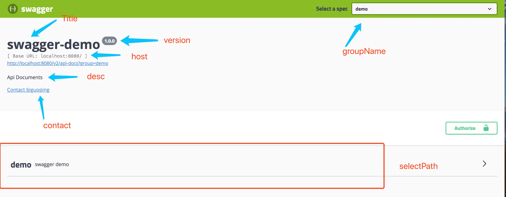
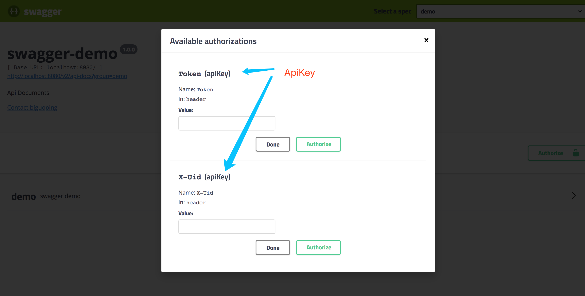

缺省情况下,配置`title`就行
```property
youyu.swagger.api.title=${spring.application.name}
```

自定义配置
```property
youyu.swagger.api.title=${spring.application.name}
youyu.swagger.api.description=Api Documents
youyu.swagger.api.version=1.0.0
youyu.swagger.api.contact.name=biguoping
youyu.swagger.api.contact.email=biguoping@yofish.com
youyu.swagger.instant.api-keys=Token,X-Uid
youyu.swagger.instant.docket-bean-name=swaggerDemoDocket
youyu.swagger.instant.group-name=demo
youyu.swagger.instant.select-path=/demo/*
youyu.swagger.instant.host=localhost:8080
```


